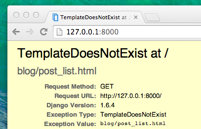

# Django views - time to create!

Time to get rid of the bug we created in last chapter :)

A view is where put the "logic" of our application. It will request information from the `model` you created before and pass it to a `template` that you will create in next chapter. Views are just Python methods that are a little bit more complicated than what we did in "Introduction to Python" chapter.

Views are placed in `mysite/blog/views.py` file.

## blog/views.py

Ok, let's open up this file and see what's in there:

    from django.shortcuts import render

    # Create your views here.

Not too much stuff here yet. The simplest view can look like that.

    def post_list(request):

        return render(request, 'blog/post_list.html', {})

As you can see, we created a method (`def`) called `post_list` that takes `request` and `return` a method `render` that will render (put together) our template `blog/post_list.html`. Easy, right?

Save the file, go to http://127.0.0.1:8000/ and see what we got now.

Another error! Read what's going on now:

This one is easy: *TemplateDoesNotExist*. Let's fix this bug and create a template in next chapter!
