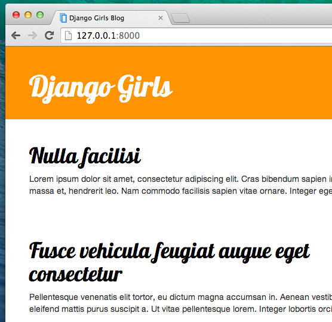
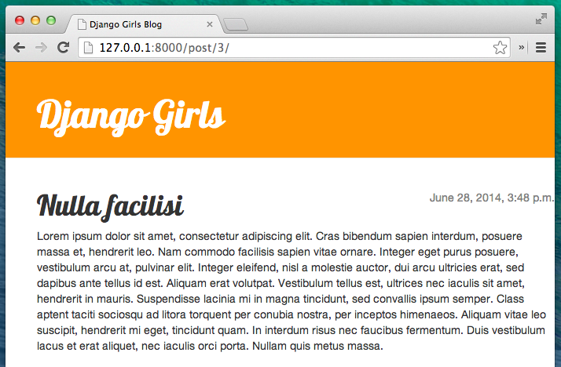



# برنامه خود را توسعه دهید

ما تقریباً تمام مراحل مورد نیاز برای ساخت یک وبسایت را کامل کرده ایم: می‌دانیم که چطور یک مدل، آدرس، view و template بنویسیم. علاوه بر این می‌دانیم که چطور وبسایت خود را زیبا کنیم.

زمان تمرین است!

اولین چیزی که در وبلاگمان لازم داریم صفحه‌ای است که یک پست را نشان دهد، درست است؟

ما یک مدل `Post` داریم پس لازم نیست چیزی به فایل `models.py` اضافه کنیم.

## ساختن لینک به جزییات پست در تمپلیت

ما با اضافه کردن یک لینک به فایل `blog/templates/blog/post_list.html` آغاز می‌کنیم. این فایل را در ویرایشگر کد باز کنید و تا اینجا باید شبیه به این باشد: blog/templates/blog/post_list.html

```html



    
        <div class="post">
            <div class="date">
                {{ post.published_date }}
            </div>
            <h2><a href="">{{ post.title }}</a></h2>
            <p>{{ post.text|linebreaksbr }}</p>
        </div>
    

```

 ما می‌خواهیم در لیست پست ها، یک لینک از عنوان پست وبلاگی به جزییات پست داشته باشیم. عبارت `<h2><a href="">{{ post.title }}</a></h2>` را تغییر دهید تا به صفحه جزییات پست لینک شود: 

{{ warning_icon }} blog/templates/blog/post_list.html

```html
<h2><a href="">{{ post.title }}</a></h2>
```

 زمان آن است که عبارت رازآلود `` را توضیح دهیم. همانطور که ممکن است حدس زده باشید این علامت `` به معنی آن است که ما از سیستم template tag جنگو استفاده می‌کنیم. این بار ما از یک tag استفاده خواهیم کرد که برایمان یک URL بسازد!

بخش `post_detail` به معنی آن است که جنگو انتظار دارد یک آدرس به نام post_detail، در فایل `blog/urls.py` وجود داشته باشد

حالا معنی `pk=post.pk` چیست؟ `pk` مخفف primary key (سرکلید یا کلید اولیه) است که یک نام منحصر به فرد برای هر ردیف از داده‌ها در پایگاه داده می‌باشد. چون ما سرکلیدی در مدل `Post` تعریف نکرده بودیم جنگو، یکی برای ما ساخته است (به صورت پیش فرض عددی است که به ازای هر ردیف از داده‌ها یکی اضافه می‌شود مثلاً 1، 2، 3) و آن را به عنوان یک فیلد به نام `pk` به هر پست ما اضافه کرده است. ما با نوشتن `post.pk` می‌توانیم به سرکلید شیء `Post` که قبلاً ساخته ایم، دسترسی پیدا کنیم همانطور که به سایر فیلدها دسترسی پیدا می‌کردیم (مانند `title` و `author`)!

حالا وقتی به آدرس http://127.0.0.1:8000/ می‌رویم با خظا مواجه می‌شویم (همانطور که انتظار داشتیم، چرا که ما هنوز برای `post_detail` ، یک آدرس یا یک *view* نساخته ایم). چیزی شبیه به این:


## ساختن آدرس برای جزییات یک پست وبلاگ

بیایید یک URL برای *ویو* `post_detail` در فایل `urls.py` بسازیم!

ما می‌خواهیم جزییات اولین پست ما در این **URL** دیده شود: http://127.0.0.1:8000/post/1/

بیایید یک آدرس در فایل `blog/urls.py` بسازیم تا جنگو را به *view* با نام `post_detail` هدایت کند که جزییات کامل یک پست وبلاگ را نشان می‌دهد. فایل `blog/urls.py`را در ویرایشگر کد باز کنید و خط `path('post/<int:pk>/', views.post_detail, name='post_detail'),` را اضافه کنید، چیزی شبیه به این می‌شود:

{{ warning_icon }} blog/urls.py

```python
from django.urls import path
from . import views

urlpatterns = [
    path('', views.post_list, name='post_list'),
    path('post/<int:pk>/', views.post_detail, name='post_detail'),
]
```

بخش `post/<int:pk>/` یک الگوی URL را معرفی می‌کند که برای شما توضیح خواهیم داد:

- `post/` نشان می‌دهد که آدرس باید با کلمه **post** شروع شده باشد و در ادامه آن یک **/** وجود داشته باشد. تا اینجا همه چیز خوب است.
- `<int:pk>` این بخش ممکن است کمی گیج کننده باشد، این عبارت به این معنی است که جنگو انتظار دارد که یک عدد صحیح دریافت کند و مقدار آن را به یک متغیر به نام `pk` نسبت خواهد داد.
- `/` - درنهایت ما به یک **/** در انتهای آدرس نیاز داریم.

یعنی اگر شما آدرس `http://127.0.0.1:8000/post/5/` را در مرورگر خود وارد کنید جنگو متوجه خواهد شد که شما به دنبال یک *view* به نام `post_detail` هستید و مقدار متغیر `pk` را برابر `5` قرار می‌دهد و این اطلاعات را به *view* مورد نظر ارسال می‌کند.

بسیار عالی، ما یک الگوی آدرس جدید به فایل `blog/urls.py` اضافه کردیم! حالا صفحه http://127.0.0.1:8000/ را دوباره بارگزاری کنید، بووم! سرور دوباره متوقف شده است. به کنسول نگاهی بیندازید، یک پیغام خطای دیگر دیده می‌شود!


یادتان هست که مرحله بعدی چیست؟ اضافه کردن ویو!

## اضافه کردن ویو جزییات یک پست

این بار *view* ما یک پارامتر اضافه دریافت کرده است، `pk`. *ویو* ما باید بتواند آن را دریافت کند، درست است؟ پس ما تابع خودمان را به این صورت تعریف می‌کنیم `def post_detail(request, pk):`. توجه داشته باشیم که باید دقیقاً همان نامی را استفاده کنیم که در آدرس تعریف کرده ایم (`pk`). حذف کردن این متغیر غلط است و باعث بروز خطا خواهد شد!

حالا ما می‌خواهیم فقط و فقط یک پست وبلاگی را داشته باشیم. برای اینکار از کوئری ست به شکل زیر استفاده می‌کنیم:

{{ warning_icon }} blog/views.py

```python
Post.objects.get(pk=pk)
```

اما این کد یک مشکل دارد. اگر هیچ `Post` با `سرکلید` (`pk`) وجود نداشته باشد، یک خطای زشت دریافت خواهیم کرد!


چنین چیزی را نمی‌خواهیم! اما خوشبختانه جنگو چیزی دارد که می‌تواند این مشکل را حل کند: `get_object_or_404`. در صورتی که هیچ `Post` با `pk` داده شده وجود نداشته باشد، یک صفحه خطای زیباتر یعنی صفحه `Page Not Found 404` را نشان خواهد داد.


خبر خوب اینکه شما می‌توانید صفحه `Page not found` اختصاصی برای خودتان را با سلیقه خودتان بسازید. اما این الان موضوع خیلی مهمی نیست بنابراین ما از آن رد خواهیم شد.

وقت آن است که یک *ویو* به فایل `views.py` اضافه کنیم!

در فایل `blog/urls.py` ما یک الگوی آدرس به نام `post_detail` ساختیم که به یک ویو با نام `views.post_detail` ارجاع داشت. این به این معنی است که جنگو انتظار دارد که یک تابع با نام `post_detail` در فایل `blog/views.py` وجود داشته باشد.

زمان آن است که فایل `blog/views.py` را در ویرایشگر کد باز کنید و خطوط زیر را در ردیف `from` ها اضافه کنید:

blog/views.py

```python
from django.shortcuts import render, get_object_or_404
```

و در انتهای فایل *ویو* خودمان را اضافه خواهیم کرد:

blog/views.py

```python
def post_detail(request, pk):
    post = get_object_or_404(Post, pk=pk)
    return render(request, 'blog/post_detail.html', {'post': post})
```

بله، حالا وقت بارگذاری مجدد صفحه است: http://127.0.0.1:8000/



کار می‌کند! ولی وقتی روی لینک مربوط به عنوان یک پست کلیک کنید چه اتفاقی می‌افتد؟


وای نه! یک خطای دیگر! اما حالا ما می‌دانیم که چطور با این خطا برخورد کنیم، درست است؟ ما باید یک تمپلیت اضافه کنیم!

## ساختن یک تمپلیت برای جزییات پست وبلاگی

در پوشه `blog/templates/blog` یک فایل به نام `post_detail.html` بسازید و آن را در ویرایشگر کد باز کنید.

شبیه به این خواهد بود:

blog/templates/blog/post_detail.html

```html



    <div class="post">
        
            <div class="date">
                {{ post.published_date }}
            </div>
        
        <h2>{{ post.title }}</h2>
        <p>{{ post.text|linebreaksbr }}</p>
    </div>

```

یک بار دیگر ما فایل `base.html` را اضافه کرده ایم. ما می‌خواهیم در بلوک `content` ، جزییات یک پست منتشر شده (اگر چنین پستی وجود داشت) شامل عنوان و متن را نشان دهیم. اما باید در مورد چند موضوع مهم صحبت کنیم، خب؟

` ... ` یک تمپلیت تگ است که وقتی می‌خواهیم چیزی را چک کنیم از آن استفاده می‌کنیم. (عبارت `if ... else ...` را از بخش **آشنایی با پایتون** به یاد دارید؟) در این سناریو ما می‌خواهیم بررسی کنیم آیا بخش `published_date` مربوط به یک پست خالی نیست.

بسیار خوب، ما می‌توانیم صفحه وبلاگمان را دوباره بارگذاری کنیم و ببینیم آیا خطا `TemplateDoesNotExist` از بین رفته است یا نه.



واو! بالاخره کار کرد!

# زمان دیپلوی!

خوب خواهد بود اگر ببینیم وبسایت شما هنوز روی PythonAnywhere کار میکند یا نه؟پس بیایید یک بار دیگر آن را منتشر کنیم.

خط فرمان

    $ git status
    $ git add --all .
    $ git status
    $ git commit -m "Added view and template for detailed blog post as well as CSS for the site."
    $ git push
    

سپس در کنسول [PythonAnywhere Bash console](https://www.pythonanywhere.com/consoles/) تایپ کنید:

PythonAnywhere command-line

    $ cd ~/<your-pythonanywhere-domain>.pythonanywhere.com
    $ git pull
    [...]
    

(یادتان باشد که `<your-pythonanywhere-domain>` را با زیر دامنه اصلی خود در PythonAnywhere عوض کنید البته بدون آکولادها.)

## به روزرسانی فایل‌های ایستا در سرور

سرورهایی مانند PythonAnywhere دوست دارند که با فایل‌های ایستا (مانند فایل‌های CSS) به گونه‌ای متفاوت از فایل‌های پایتون برخورد کنند، چرا که می‌توانند آن ها را بهینه کنند و سرعت لود شدن آن‌ها را افزایش دهند. در نتیجه هرگاه که ما تغییری در فایل‌های CSS می‌دهیم ، باید دستوری اضافه بر روی اجرا کنیم تا به سرور بگوییم که این فایل‌ها تغییر کرده اند. این دستور `collectstatic` نام دارد.

ابتدا با فعال کردن محیط مجازی شروع کنیم اگر از قبل هنوز فعال نیست (PythonANywhere از دستوری به نام `workon` برای این کار استفاده می‌کند این دستور دقیقاً شبیه `source myenv/bin/activate` است که شما بر روی کامپیوتر خودتان اجرا می‌کنید):

PythonAnywhere command-line

    $ workon <your-pythonanywhere-domain>.pythonanywhere.com
    (ola.pythonanywhere.com)$ python manage.py collectstatic
    [...]
    

دستور `manage.py collectstatic` تقریباً شبیه دستور `manage.py migrate` است. ما تغییراتی در کدها می‌دهیم و به جنگو می‌گوییم این تغییرات را *apply* (اعمال) کند، چه در فایل‌های ایستا در سرور باشد چه در پایگاه داده.

به هرحال، الان ما آماده هستیم، به سراغ ["Web" page](https://www.pythonanywhere.com/web_app_setup/) بروید (از طریق دکمه menu در گوشه بالا و سمت راست کنسول) و دکمه **Reload** را بزنید و سپس به صفحه https://subdomain.pythonanywhere.com نگاه کنید تا نتیجه را ببینید.

به نتیجه رسید! تبریک :)