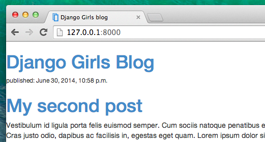
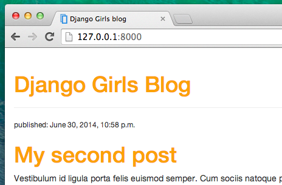
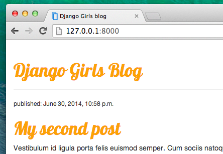
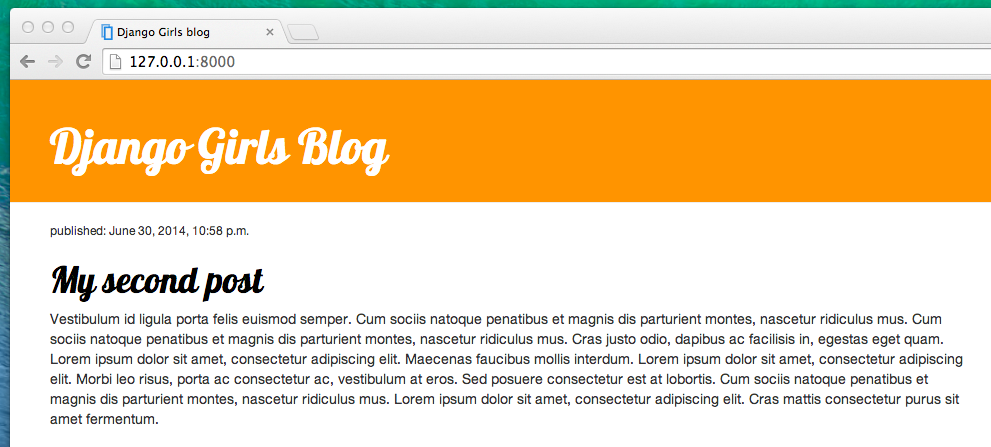

# CSS - 예쁘게 만들기

아직 우리가 만든 블로그가 예쁘지 않죠? 이제 눈에 보기 좋게 예쁘게 만들어 볼 시간이에요. CSS를 사용해 만들어볼 거에요.


## CSS는 무엇인가요?

CSS(Cascading Style Sheets)는 HTML와 같이 마크업언어(Markup Language)로 작성된 웹사이트의 외관을 꾸미기 위해 사용되는 언어입니다. 웹사이트에 메이크업을 해볼까요. ;)

아무것도 없는 상태에서 시작하기 어렵겠죠? 개발자들이 만든 오픈 소스 코드를 사용해 만들어 볼 거에요. 이미 있는 바퀴를 다시 발명하는 것은 재미가 없잖아요.


## 부트스트랩을 사용해봐요!

부트스트랩(Bootstrap)은 유명한 HTML과 CSS프레임워크로 예쁜 웹사이트를 만들 수 있습니다. : https://getbootstrap.com/

트위터 개발자들이 부트스트랩을 만들었고, 전 세계 자원봉사자들이 지속적으로 참여해 발전시키고 있어요!


## 부트스트랩 설치하기

부트스트랩을 설치하려면, `.html`파일 내 `<head>`에 이 링크를 넣어야 합니다.

blog/templates/blog/post_list.html

```html
<link rel="stylesheet" href="//maxcdn.bootstrapcdn.com/bootstrap/3.2.0/css/bootstrap.min.css">
<link rel="stylesheet" href="//maxcdn.bootstrapcdn.com/bootstrap/3.2.0/css/bootstrap-theme.min.css">
```

이 링크는 프로젝트에 새 파일을 추가하는 게 아니에요. 인터넷에 있는 파일을 연결하는 거죠. 이제 웹사이트를 열어 새로고침 버튼을 눌러보세요. 짠!



어때요, 보기 좋아졌죠!


## 정적 파일

마지막으로 __정적 파일(static files)__ 을 다뤄볼 거에요. 정적 파일은 CSS와 이미지 파일에 해당합니다. 이 컨텐츠는 요청 내용에 따라 바뀌는 것이 아니기 때문에 모든 사용자들이 동일한 내용을 볼 수 있어요.


### 정적 파일은 어디에 넣어야 하나요

서버에서 `collectstatic`를 실행할 때 처럼, 장고는 "admin"앱에서 동적 파일을 어디서 찾아야하는지 이미 알고 있어요. 이제 "blog"앱에 동적파일을 추가하면 됩니다.

"blog"앱 안에 `static`라는 새 폴더를 만드세요. :

```
    djangogirls
    ├── blog
    │   ├── migrations
    │   └── static
    └── mysite
```

장고는 app 폴더 안에 있는 `static`폴더를 자동으로 찾을 수 있어요. 이 컨텐츠를 정적 파일로 사용하게 되는 것입니다.


## 나의 첫 번째 CSS 파일!

CSS파일을 만들어 나만의 스타일을 가진 웹페이지를 만들어봐요. `static`디렉토리 안에 `css`라고 새로운 디렉토리를 만드세요. 그리고 `css`디렉토리 안에 `blog.css`라는 파일을 만드세요. 준비되셨나요?

```
    djangogirls
    └─── blog
         └─── static
              └─── css
                   └─── blog.css
```

CSS를 쓸 차례에요! 코드 에디터에서 `blog/static/css/blog.css`파일을 열어보세요.

CSS는 꽤 쉽고 워크샵 후에도 스스로 배울 수 있기 때문에 CSS에 대해 깊이 살펴보지는 않을 거에요. 이 장 맨 마지막 부분에 추천하는 무료 사이트가 있습니다.

하지만 조금이라도 해보자구요. 제목 색상을 바꿔볼까요? 컴퓨터는 특별한 코드를 사용해 색상을 나타내요. `#`으로 시작해 알파벳(A-F)와 숫자(0-9) 중 6개를 조합해 헥사코드(hexacode)로 나타냅니다. 이 곳에서 원하는 색상 코드를 찾을 수 있어요. [https://www.colorpicker.com/](https://www.colorpicker.com/) 또는 `빨간색(red)` 또는 `녹색(green)` 등 [미리 명시된 색상](http://www.w3schools.com/colors/colors_names.asp)을 사용할 수 있어요.

`blog/static/css/blog.css` 파일에 아래 코드를 추가하세요. :

blog/static/css/blog.css
```css
h1 a {
    color: #FCA205;
}
```

`h1 a`는 CSS 셀렉터(Selector)라고 합니다. `h1`요소 안에 어떠한 `a`요소를 넣어 스타일을 적용 할 수 있다는 거죠. 예를 들어 `<h1><a href="">link</a></h1>` 라면, 오렌지색 `#FCA205`으로 바꿀 수 있어요. 물론, 내가 원하는 다른 색상을 지정할 수 있어요!

CSS 파일에서는 HTML 파일에 있는 각 요소들에 스타일을 정의할 수 있어요. 요소를 식별하는 첫 번째 방법은 요소 이름을 사용하는 것입니다. HTML 섹션에서 태그로 기억할 수 있습니다. `a`,`h1`,`body`와 같은 것은 모두 요소 이름의 예입니다. 또 `class` 속성이나 `id` 속성에 의해 요소를 식별합니다. 클래스와 ID는 요소에 직접 부여한 이름이에요. 클래스는 요소 그룹을 정의하고 ID는 특정 요소를 가리킵니다. 아래 코드와 같이 태그 이름은 `a`, 클래스는 `external_link` 또는 ID는 `link_to_wiki_page`로 사용하여 태그를 통해 요소를 식별할 수 있습니다.

```html
<a href="https://en.wikipedia.org/wiki/Django" class="external_link" id="link_to_wiki_page">
```

W3Schools에서 [CSS 선택자](https://www.w3schools.com/cssref/css_selectors.asp)에 대해 읽어보시길 바랍니다.

이제 CSS를 HTML에 추가해봅시다. `blog/templates/blog/post_list.html` 파일을 열고 맨 처음 줄에 이 라인을 추가하세요.

blog/templates/blog/post_list.html
```html

```

여기에서 동적 파일을 로딩하는 거에요. :)
다음 `<head>`와 `</head>` 사이에 부트스트랩 CSS파일 링크 다음에 아래 코드를 추가하세요.

blog/templates/blog/post_list.html
```html
<link rel="stylesheet" href="">
```

브라우저는 주어진 순서대로 파일을 읽으므로 파일이 올바른 위치에 있는지 확인해야합니다. 그렇지 않으면 파일 코드가 부트 스트랩 파일의 코드를 무시할 수 있습니다.
이제까지 CSS파일이 있는 템플릿에 대해 알아보았어요.

코드는 아래와 같아야 해요.

blog/templates/blog/post_list.html
```html

<html>
    <head>
        <title>Django Girls blog</title>
        <link rel="stylesheet" href="//maxcdn.bootstrapcdn.com/bootstrap/3.2.0/css/bootstrap.min.css">
        <link rel="stylesheet" href="//maxcdn.bootstrapcdn.com/bootstrap/3.2.0/css/bootstrap-theme.min.css">
        <link rel="stylesheet" href="">
    </head>
    <body>
        <div>
            <h1><a href="/">Django Girls Blog</a></h1>
        </div>

        
            <div>
                <p>published: {{ post.published_date }}</p>
                <h1><a href="">{{ post.title }}</a></h1>
                <p>{{ post.text|linebreaksbr }}</p>
            </div>
        
    </body>
</html>
```

자, 이제 파일을 저장하고 새로고침을 해보세요!


잘했어요! 웹사이트 왼쪽 여백을 좀더 주고 싶지 않나요? 한번 해봐요!

blog/static/css/blog.css
```css
body {
    padding-left: 15px;
}
```

이 코드를 CSS에 붙여넣고, 파일을 저장하고 어떻게 바뀌었는지 확인해봐요!



제목 폰트를 바꾸고 싶나요? `blog/templates/blog/post_list.html` 파일 내 `<head>`부분에 아래 코드를 붙여넣기 해보세요.

blog/templates/blog/post_list.html
```html
<link href="//fonts.googleapis.com/css?family=Lobster&subset=latin,latin-ext" rel="stylesheet" type="text/css">
```

`blog/static/css/blog.css` 파일 내 넣은 코드의 순서와 위치를 다시 확인해보세요. 이 라인은 Google 글꼴 (https://www.google.com/fonts)에서 * Lobster* 라는 글꼴을 가져온 것을 말해요.

그리고 CSS파일  `blog/static/css/blog.css` 에서`h1 a` 선언 블록 (중괄호`{`와`}`) 사이의 코드를 찾으세요. `font-family : 'Lobster';` 를 중괄호 사이에 추가하고 페이지를 새로고침 합니다.


blog/static/css/blog.css
```css
h1 a {
    color: #FCA205;
    font-family: 'Lobster';
}
```



잘했어요!

앞서 말했듯이, CSS는 클래스 개념을 가지고 있어요. 클래스는 HTML의 코드 일부에 이름을 붙이고 그 부분만 특정 스타일을 적용할 수 있게 해줍니다. 각기 다른 div를 (예를 들어 하나는 제목에 있고 하나는 글 본문에 있는 경우) 구분할 때 정말 유용해요. HTML 코드의 일부 이름을 지정하십시오. 

제목이 포함된 `div`에 `page-header`라는 클래스명을 붙여보세요. :

blog/templates/blog/post_list.html
```html
<div class="page-header">
    <h1><a href="/">Django Girls Blog</a></h1>
</div>```

그리고 블로그 게시글을 나타내는 `div`에 `post`라고 클래스명을 붙여보세요.

blog/templates/blog/post_list.html
```html
<div class="post">
    <p>published: {{ post.published_date }}</p>
    <h1><a href="">{{ post.title }}</a></h1>
    <p>{{ post.text|linebreaksbr }}</p>
</div>
```

이제 여러 선택자들을 추가해봅시다. 클래스 선택자는 `.`으로 시작합니다. 인터넷에 많은 CSS 튜토리얼과 설명 가이드가 있으니 찾아보면 도움이 될 거에요. 이제 `blog/static/css/blog.css` 파일에 아래 코드를 복사, 붙여넣기 하세요.


blog/static/css/blog.css
```css
.page-header {
    background-color: #ff9400;
    margin-top: 0;
    padding: 20px 20px 20px 40px;
}

.page-header h1, .page-header h1 a, .page-header h1 a:visited, .page-header h1 a:active {
    color: #ffffff;
    font-size: 36pt;
    text-decoration: none;
}

.content {
    margin-left: 40px;
}

h1, h2, h3, h4 {
    font-family: 'Lobster', cursive;
}

.date {
    color: #828282;
}

.save {
    float: right;
}

.post-form textarea, .post-form input {
    width: 100%;
}

.top-menu, .top-menu:hover, .top-menu:visited {
    color: #ffffff;
    float: right;
    font-size: 26pt;
    margin-right: 20px;
}

.post {
    margin-bottom: 70px;
}

.post h1 a, .post h1 a:visited {
    color: #000000;
}
```

자, 다음은 글을 보여주는 HTML 코드를 post라는 클래스 명을 선언해 div로 감싸세요. 이렇게 바꾸면 됩니다. :

blog/templates/blog/post_list.html
```html

    <div class="post">
        <p>published: {{ post.published_date }}</p>
        <h1><a href="">{{ post.title }}</a></h1>
        <p>{{ post.text|linebreaksbr }}</p>
    </div>

```
`blog/templates/blog/post_list.html` 파일 안에 아래 코드를 넣으세요.

blog/templates/blog/post_list.html
```html
<div class="content container">
    <div class="row">
        <div class="col-md-8">
            
                <div class="post">
                    <div class="date">
                        <p>published: {{ post.published_date }}</p>
                    </div>
                    <h1><a href="">{{ post.title }}</a></h1>
                    <p>{{ post.text|linebreaksbr }}</p>
                </div>
            
        </div>
    </div>
</div
```

파일을 저장하고 웹 사이트를 새로고침하세요.



방금 붙여 넣은 코드를보고 HTML에 클래스를 추가하고 CSS에서 사용했던 곳을 찾아보세요. 날짜를 초록색으로 바꾸려면 어느 부분을 수정하면 될까요?

CSS를 바꿔보는 것을 두려워하지 마세요. CSS를 가지고 놀다보면 어떻게 작동되는지 좀더 이해할 수 있을 거에요. 망가뜨렸더라도 괜찮아요. 언제든지 되돌릴 수 있으니까요!

무료 온라인 [Codecademy HTML & CSS 코스](https://www.codecademy.com/tracks/web)를 수강해보는 것을 추천합니다. CSS로 웹 사이트를 더 아름답게 만드는 방법을 배울 수 있어요.

다음 장을 읽을 준비가 되셨나요?! :)
