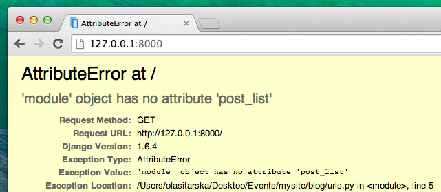

# 장고 urls

첫 웹 페이지를 만들어 봅시다. 블로그 홈페이지요! 먼저 장고 url에 대해서 조금 배워보기로 합시다.

## URL이란 무엇인가요?

URL은 웹 주소랍니다. 웹 사이트를 방문할 때마다 브라우저의 주소창에 URL을 볼 수 있죠. 맞아요! `127.0.0.1:8000`이 바로 URL이에요. `https://djangogirls.org/`도 URL이랍니다.


인터넷의 모든 페이지는 고유한 URL을 가지고 있어야 해요. 애플리케이션은 사용자가 URL을 입력하면 어떤 내용을 보여줘야 하는지 알고 있어요. 장고는 `URLconf (URL configuration)`를 사용합니다. `URLconf`는 장고에서 URL과 일치하는 뷰를 찾기 위한 패턴들의 집합입니다.

## 장고 URL은 어떻게 작동할까요?

코드 에디터에서 `mysite/urls.py`파일을 열면 아래 내용이 보일 거에요.

mysite/urls.py
```python
"""mysite URL Configuration

[...]
"""
from django.conf.urls import url
from django.contrib import admin

urlpatterns = [
    url(r'^admin/', admin.site.urls),
]
```

장고가 이미 어떤 내용을 넣어 두었네요.

`#`로 시작되는 줄은 주석이에요. 파이썬은 주석을 실행하지 않아요. 꽤 유용하겠죠?

이전 장에서 봤던 관리자 URL도 여기에 이미 있어요.

mysite/urls.py
```python
    url(r'^admin/', admin.site.urls),
```

장고는 `admin/`로 시작하는 모든 URL을  *view*와 대조해 찾아냅니다. 무수히 많은 URL이 `admin URL`에 포함될 수 있어 일일이 모두 쓸 수 없답니다. 그래서 정규표현식을 사용합니다.

## 정규표현식(Regex)

장고가 URL을 뷰에 매칭시키는 방법이 궁금하죠? 이 부분은 조금 어렵게 느껴질 수 있어요. 장고는 `regex`를 사용하는데, 이는 `정규표현식(regular expressions)`의 줄임말입니다. 정규식은 정말 (아주!) 많은 검색 패턴의 규칙을 가지고 있어요. 정규식은 어려운 내용이라 자세하게 알아보지 않을 거에요.

URL패턴 만드는 방법이 궁금하다면, 다음 표기법을 확인하세요. 이 중 몇 가지 규칙만 사용할 거에요.

* ^ : 문자열이 시작할 떄
* $ : 문자열이 끝날 때
* \d : 숫자
* + : 바로 앞에 나오는 항목이 계속 나올 때
* () : 패턴의 부분을 저장할 때

이외에도 문자열을 이용해 url을 만들 수 있어요.

`http://www.mysite.com/post/12345/`라는 사이트가 있다고 합시다. 여기에서 `12345`는 글 번호를 의미합니다.

뷰마다 모든 글 번호을 일일이 매기는 것은 정말 힘들죠. 정규표현식으로 url패턴을 만들어 숫자값과 매칭되게 할 수 있어요. 이렇게 말이죠. `^post/(\d+)/$`. 어떤 뜻인지 하나씩 살펴봅시다.

*  **^post/** : url이(오른쪽부터) `post/`로 시작합니다.
*  **(\d+)** : 숫자(한 개 이상)가 있습니다. 이 숫자로 조회하고 싶은 게시글을 찾을 수 있어요.
*  **/** : `/`뒤에 문자가 있습니다.
*  **$** : url 마지막이 `/`로 끝납니다.

## 나의 첫 번째 Django url!

첫 번째 URL을 만들어 봅시다! 우리는 '<http://127.0.0.1:8000/>'가 홈페이지 주소로 만들어 글 목록이 보이게 만들어 볼 거에요.

또한 `mysite/urls.py`파일을 깨끗한 상태로 유지하기 위해, `blog` 애플리케이션에서 메인 `mysite/urls.py`파일로 url들을 가져올 거에요.

먼저 `#`로 시작하는 줄을 삭제하고 `main url('')`로 `blog.urls`를 가져오는 행을 추가해 봅시다.

이제 `mysite/urls.py` 파일은 아래처럼 보일 거에요.

mysite/urls.py
```python
from django.conf.urls import include, url
from django.contrib import admin

urlpatterns = [
    url(r'^admin/', admin.site.urls),
    url(r'', include('blog.urls')),
]
```

지금 장고는 http://127.0.0.1:8000/ 로 들어오는 모든 접속 요청을 `blog.urls`로 전송해 추가 명령을 찾을 거예요.

파이썬에서 정규 표현식을 작성할 때는 항상 문자열 앞에 `r`을 붙입니다. 이는 파이썬에게는 별 의미가 없지만, 파이썬에게 문자열에 특수 문자를 있다는 것을 알려줍니다.

## blog.urls

`blog/urls.py`이라는 새 파일을 생성하세요. 좋아요! 이제 아래 두 줄을 추가하세요.

blog/urls.py
```python
from django.conf.urls import url
from . import views
```

우리는 장고의 메소드와 `blog` 애플리케이션에서 사용할 모든 `views`를 불러오고 있어요. (물론 아직 뷰를 하나도 안 만들었지만, 곧 만들거니 조금만 기다리세요!)

그 다음, 첫 번째 URL 패턴을 추가하세요.

blog/urls.py
```python
urlpatterns = [
    url(r'^$', views.post_list, name='post_list'),
]
```

이제 `post_list`라는 이름의 `view`가 `^$` URL에 할당되었습니다. 이 정규표현식은 `^`에서 시작해 `$`로 끝나는 지를 매칭할 것입니다. 즉 문자열이 아무것도 없는 경우만 매칭하겠죠. 틀린 것이 아니에요. 왜냐하면 장고 URL 확인자(resolver)는 '<http://127.0.0.1:8000/>' 는 URL의 일부가 아니기 때문입니다. 이 패턴은 장고에게 누군가 웹사이트에 '<http://127.0.0.1:8000/>' 주소로 들어왔을 때 `views.post_list`를 보여주라고 말할 거에요.

마지막 부분인 `name='post_list'`는 URL에 이름을 붙인 것으로 뷰를 식별합니다. 뷰의 이름과 같을 수도 완전히 다를 수도 있습니다. 이름을 붙인 URL은 프로젝트의 후반에 사용할 거예요. 그러니 앱의 각 URL마다 이름 짓는 것은 중요합니다. URL에 고유한 이름을 붙여, 외우고 부르기 쉽게 만들어야 해요.

http://127.0.0.1:8000/ 접속했는데 '웹 페이지를 사용할 수 없음(web page not available)'이라는 메시지가 표시되었나요?. 이는 서버(`runserver`라고 입력하는 것을 기억 하는가?)가 실행되지 않았기 때문이에요. 에러가 발생한 이유를 찾으려면 서버 콘솔 창을 보세요.


콘솔에서 에러가 발생했네요. 하지만 걱정하지 마세요. 에러는 해결할 방법을 알려준답니다. :   __no attribute 'post_list'__ 라는 메시지가 보일 텐데요. 이것은 장고가 찾고 사용하려고하는 *뷰*가 아직 없다는 거에요. 이 단계에서 `/admin/`로도 접속되지 않을 거에요. 앞으로 고쳐볼 테니 걱정하지 마세요.

> 장고 URL 설정에 대해 더 알고 싶다면 장고 공식 문서를 읽어보세요. :
https://docs.djangoproject.com/en/1.10/topics/http/urls/
