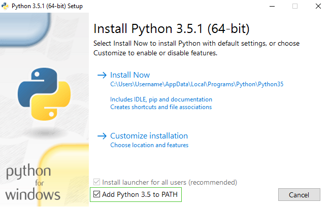
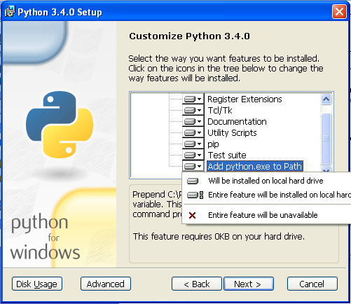

> **Note** 집에서 학습하시는 분들은 [파이썬 & 코드에디터 설치하기](https://www.youtube.com/watch?v=pVTaqzKZCdA) 영상을 보세요.


> **Note** 이 장은 Geek Girls Carrots (https://github.com/ggcarrots/django-carrots) 튜토리얼을 기초로 작성되었습니다.

장고는 파이썬 언어로 작성됐습니다. 파이썬이 있어야 장고를 할 수 있어요. 우선 설치부터 해볼까요! 우리는 파이썬 3.6를 사용할 거예요. 이보다 낮은 버전이 설치되었다면, 버전 업그레이드 하세요.

<!--sec data-title="Windows" data-id="python_windows_ko" data-collapse=true ces-->

사용 중인 컴퓨터 윈도우 운영체제가 32비트인지 64비트인지 확인하려면 https://support.microsoft.com/en-au/kb/827218 에서 확인하세요. 윈도우 용 파이썬은 https://www.python.org/downloads/windows/ 웹 사이트에서 다운로드 할 수 있습니다. "Latest Python 3 Release - Python x.x.x"링크를 클릭하세요. **64 비트** 버전의 Windows인 경우 **Windows x86-64 executable installer**를 다운로드하세요. 이외에는 **Windows x86 executable installer**을 다운로드하세요. 설치 프로그램을 다운로드 한 후에 실행(더블 클릭)하고 지시 사항을 따르세요.

> **Note** 설치하는 동안 "Setup(설치하기)"이라고 표시된 창이 나타납니다. 다음과 같이 "Add Python 3.6 to PATH(python3.6를 경로에 추가)"체크 박스를 체크하고 "Install Now(지금 설치하기)"를 클릭하세요.



다음 단계에서는 윈도우 명령 프롬프트를 사용할 거에요 (윈도우 명령어도 알려드릴 거에요. 지금은 일부 명령을 입력해야하는 경우 시작 메뉴 → 모든 프로그램 → 보조 프로그램 → 명령 프롬프트로 이동하세요. Windows 키를 누르고 "실행"창이 팝업 될 때까지 "R"키를 누르면 됩니다. 명령어를 입력하려면 "cmd"를 입력하고 "실행"창에서 엔터키를 누르세요. (윈도우 최신 버전에서는 "명령 프롬프트"가 메뉴에 없을 수 있어 검색해 실행하면 됩니다)


> **Note** 윈도우 이전 버전(윈도우7, Vista 등)에서 파이썬 3.6.x 설치오류가 생기면, 다음과 같이 해보세요.

1. 모든 윈도우 업데이트 후 파이썬 3.6를 다시 설치합니다.
2. 또는 [파이썬 이전 버전](https://www.python.org/downloads/windows/)을 설치합니다. 

버전이 낮은 파이썬 설치 시, 설치 화면이 위에 표시된 것과 약간 다르게 보일 수 있습니다. "Add Python 3.6. to PATH"를 보려면 아래로 스크롤 한 다음 왼쪽의 버튼을 클릭하고 "Will be installed on local hard drive(로컬 하드 드라이브에 설치)"를 선택하세요.



<!--endsec-->

<!--sec data-title="OS X" data-id="python_OSX_ko"
data-collapse=true ces-->

> **Note** OS X에서는 파이썬 설치하기 전, Mac 설정에서 App Store가 아닌 패키지를 설치할 수 있도록 설정해야합니다. 시스템 환경 설정 (응용 프로그램 폴더에 있음)으로 이동하여 "보안 및 개인 정보"를 클릭 한 다음 "일반"탭을 클릭하세요. "다운로드 한 응용 프로그램 허용"이 "Mac App Store"로 설정된 경우 "Mac App Store 및 확인된 개발자"로 변경하세요.

웹 사이트로 가서 파이썬 설치 파일을 다운 받으세요. : https://www.python.org/downloads/release/python-351/

* *Mac OS X 64-bit/32-bit installer* 파일을 다운받습니다.
* *python-3.6.1-macosx10.6.pkg*을 더블클릭해 설치합니다.

<!--endsec-->

<!--sec data-title="Linux" data-id="python_linux_ko"
data-collapse=true ces-->

이미 파이썬이 설치되었을 겁니다. 설치된 버전을 확인하려면 콘솔을 열고 다음 명령을 입력하세요. :

command-line
```
$ python3 --version
Python 3.6.1
```

3.6.0 버전과 같이 '마이크로 버전'의 파이썬이 설치되어있는 경우 업그레이드 할 필요가 없습니다. 다른 버전의 파이썬을 설치하고 싶으면 아래와 같이하면 됩니다. :

<!--endsec-->


<!--sec data-title="Debian / Ubuntu" data-id="python_debian_ko"
data-collapse=true ces-->

콘솔에 아래 명령어를 입력하세요. :

command-line
```
$ sudo apt-get install python3.6
```

<!--endsec-->

<!--sec data-title="Fedora (up to 21)" data-id="python_fedora_ko"
data-collapse=true ces-->


콘솔에 아래 명령어를 입력하세요. :

command-line
```
$ sudo yum install python3
```

<!--endsec-->

<!--sec data-title="Fedora (22+)" data-id="python_fedora22_ko"
data-collapse=true ces-->

콘솔에 아래 명령어를 입력하세요. :

command-line
```
$ sudo dnf install python3
```

<!--endsec-->

<!--sec data-title="openSUSE" data-id="python_openSUSE_ko"
data-collapse=true ces-->

콘솔에 아래 명령어를 입력하세요. :

command-line
```
$ sudo zypper install python3
```

<!--endsec-->

설치가 성공적으로 마쳤는지 확인하려면, *터미널* 을 열고 `python3` 명령어를 입력해보세요.

command-line
```
$ python3 --version
Python 3.6.1
```

> **Note** 윈도우에서 `python3`명령어를 입력한 후 에러 메세지가 나온다면 `python`(`3`을 빼고)이라 입력해보고 파이썬 3.6버전인지 체크해보세요.

설치 도중 문제가 생기거나 잘되지 않으면 코치들에게 도움을 요청하세요! 가끔은 경험이 많은 분들에게 도움을 받는 것이 더 좋을 수 있습니다.
