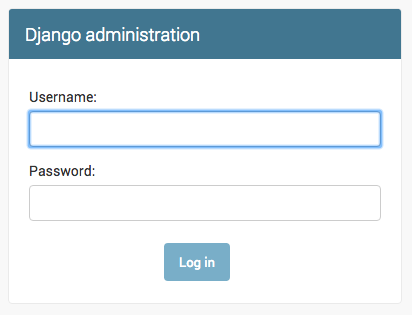

# Administracja Django (admin)

Aby dodawać, modyfikować i usuwać wpisy, do których stworzyliśmy wcześniej modele, posłużymy się panelem admina Django.

Otwórzmy plik `blog/admin.py` i zastąpmy jego zawartość poniższym:

    from django.contrib import admin
    from .models import Post

    admin.site.register(Post)

Jak widać, importujemy (dołączamy) model Post, który zdefiniowałyśmy w poprzednim rozdziale. Aby nasz model był widoczny w panelu admina, musimy go zarejestrować za pomocą polecenia `admin.site.register(Post)`.

OK, czas rzucić okiem na nasz model Post. Nie zapomnij uruchomić serwera za pomocą polecenia `python manage.py runserver` w swojej konsoli. Przejdź do swojej przeglądarki i wpisz adres: http://127.0.0.1:8000/admin/. Zobaczysz stronę logowania podobną do tej:

Aby móc się zalogować, musisz utworzyć konto administratora (*superuser*) - czyli użytkownika, który posiada nieograniczony dostęp do całej strony. Wróć do wiersza poleceń i wpisz `python manage.py createsuperuser`. Zatwierdź klawiszem Enter. Zostaniesz poproszona o wpisanie swojej nazwy użytkownika (małymi literami, bez spacji i polskich znaków), adresu e-mail oraz hasła. Treść widoczna na ekranie powinna wyglądać następująco (wpisz własną nazwę użytkownika i adres email):

    (myvenv) ~/djangogirls$ python manage.py createsuperuser
    Username: admin
    Email address: admin@admin.com
    Password:
    Password (again):
    Superuser created successfully.

Wróć do przeglądarki i zaloguj się danymi administratora, które wprowadziłaś wcześniej. Powinnaś zobaczyć panel admina Django.

Przejdź do sekcji Posts i poeksperymentuj trochę. Dodaj pięć-sześć wpisów. Nie przejmuj się ich treścią - możesz dla zaoszczędzenia czasu kopiować i wklejać treści z tego kursu :).

Postaraj się, aby przynajmniej dwa-trzy wpisy (ale nie wszystkie!) miały ustawioną datę publikacji. Przyda nam się nieco później.

Jeśli chcesz dowiedzieć się więcej o panelu admina Django, powinnaś sprawdzić dokumentację Django: https://docs.djangoproject.com/en/1.7/ref/contrib/admin/

To zdecydowanie dobra okazja na filiżankę kawy (lub herbaty) i schrupanie czegoś słodkiego. Stworzyłaś swój pierwszy model w Django - zasługujesz na małą nagrodę!
