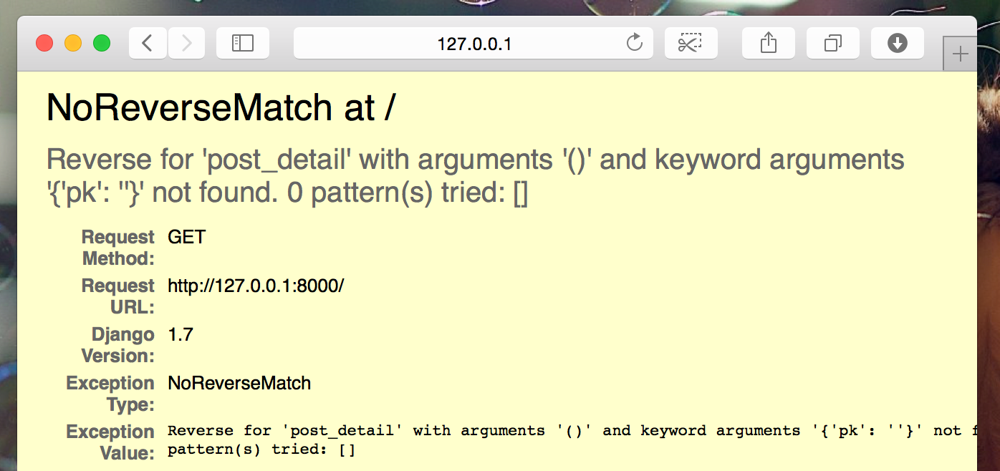
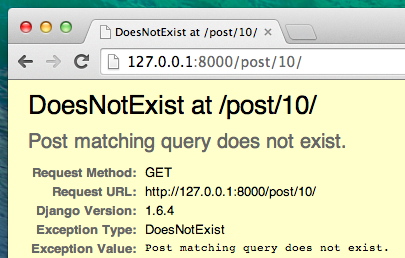
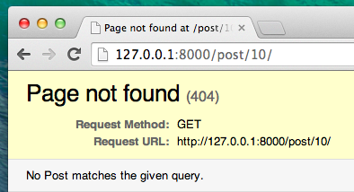
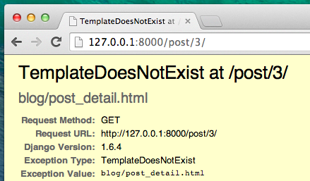

# Rozbudowa aplikacji

Przeszłyśmy już wszystkie kroki niezbędne do uruchomienia naszej strony: wiemy, jak opisać nasze modele, widoki, adresy URL i szablony. Umiemy również sprawić, aby nasza strona wyglądała ładniej.

Czas na odrobinę praktyki!

Pierwszą rzeczą, której nasz blog potrzebuje, to strona wyświetlająca pojedynczy wpis, nieprawdaż?

Mamy już model `Post`, więc nie musimy już dodawać niczego do `models.py`.

## Tworzenie linku w szablonie

Zaczniemy od dodania linku wewnątrz pliku `blog/templates/blog/post_list.html`. Do tej pory plik powinien wyglądać tak:

    

    
        
            

                

                    {{ post.published_date }}
                

                <h1><a href="">{{ post.title }}</a></h1>
                
{{ post.text|linebreaks }}

            

        
    

Chcemy, aby tytuł wpisu był linkiem prowadzącym do strony ze szczegółami wpisu. Zmieńmy `<h1><a href="">{{ post.title }}</a></h1>` w link:

    <h1><a href="">{{ post.title }}</a></h1>

Czas wyjaśnić, co oznacza to tajemnicze ``. Jak można podejrzewać, zapis `` oznacza, że używamy tagów szablonu Django. Tym razem używamy takiego, który generuje za nas adres strony!

`blog.views.post_detail` to ścieżka do *widoku* `post_detail`, który chcemy stworzyć. Zwróć uwagę: `blog` to nazwa Twojej aplikacji (folder `blog`), `views` pochodzi od nazwy pliku `views.py`, zaś ostatnia część - `post_detail` - to nazwa naszego *widoku*.

Teraz, gdy przejdziemy pod adres:

    http://127.0.0.1:8000/

ujrzymy błąd (co było do przewidzenia, bo nie mamy jeszcze ustawionego adresu URL ani *widoku* dla `post_detail`). Będzie to wyglądać tak:

Dodajmy adres URL w pliku `urls.py` dla naszego *widoku* `post_detail`!

### URL: http://127.0.0.1:8000/post/1/

Potrzebujemy stworzyć adres URL wskazujący na *widok* o nazwie `post_detail`, który wyświetli nam cały wpis. Dodaj wiersz `url(r'^post/(?P<pk>[0-9]+)/$', views.post_detail),` w pliku `blog/urls.py`. Powinna wyglądać tak:

    from django.conf.urls import patterns, include, url
    from . import views

    urlpatterns = patterns('',
        url(r'^$', views.post_list),
        url(r'^post/(?P<pk>[0-9]+)/$', views.post_detail),
    )

Strasznie to wygląda, ale spokojnie - wyjaśniamy: - zaczyna się od `^` again -- "początek" - `post/` oznacza tylko, że zaraz po początku adres URL powinien zawierać słowo **post** i **/**. Na razie nie jest źle. - `(?P<pk>[0-9]+)` - ta część jest trudniejsza. Oznacza ona, że Django pobierze wszystko, co umieścisz w tym miejscu i przekaże to do widoku w zmiennej o nazwie `pk`. `[0-9]` dodatkowo mówi nam, że może to być tylko cyfra, nie litera (czyli wszystko pomiędzy 0 a 9). `+` oznacza, że to musi być jedna lub więcej cyfr. Czyli coś takiego: `http://127.0.0.1:8000/post//` nie jest poprawne, ale już `http://127.0.0.1:8000/post/1234567890/` jest jak najbardziej w porządku! - `/` - znów potrzebujemy **/** - `$` - "koniec"!

To oznacza, że gdy wpiszesz w przeglądarce adres `http://127.0.0.1:8000/post/5/`, Django zrozumie, że potrzebujesz *widoku* zwanego `post_detail` i przekaże temu *widokowi* informację, że `pk` jest równe `5`.

`pk` to skrót od `primary key` (ang. klucz główny). Nazwa ta jest często używana w projektach Django. Ale możesz nazwać tę zmienną jak Ci się żywnie podoba (tylko pamiętaj: same małe litery i znak `_` zamiast spacji!). Dla przykładu, zamiast `(?P<pk>[0-9]+)` możemy mieć zmienną `post_id`. Wówczas ten fragment wyglądałby tak: `(?P<post_id>[0-9]+)`.

OK! No to odświeżmy stronę:

    http://127.0.0.1:8000/

Bum! Znowu błąd! Tak jak myślałyśmy!

Pamiętasz, jaki jest następny krok? Oczywiście: dodanie widoku!

## Widok post_detail

Tym razem nasz *widok* otrzymuje dodatkowy parametr `pk`. Nasz *widok* musi go "złapać", zgadza się? A więc zdefiniujmy funkcję tak: `def post_detail(request, pk):`. Zwróć uwagę, że musimy użyć dokładnie tej samej nazwy jak ta, której użyłyśmy w pliku urls (`pk`). Pominięcie tej zmiennej jest niepoprawne i spowoduje błąd!

Teraz chcemy wyświetlić jeden i tylko jeden wpis na blogu. Aby to zrobić, możemy użyć querysetów w następujący sposób:

    Post.objects.get(pk=pk)

Ale jest jeden problem. Jeśli nie istnieje żaden wpis (`Post`) zawierający przekazany `klucz główny` (`pk`) , to ujrzymy przepaskudny błąd!

Tak nie może być! Ale oczywiście Django ma dla nas coś, co rozwiąże ten problem za nas: `get_object_or_404`. W sytuacji, gdy nie istnieje żaden wpis (`Post`) z przekazaną wartością `pk`, wyświetli znacznie przyjemniejszą stronę (zwaną `Page Not Found 404` albo stroną błędu 404 - informującą, że dana strona nie została znaleziona).

Dobra wiadomość - możesz stworzyć własną stronę błędu 404 i upiększyć ją tak, jak tylko Ci się podoba. Ale teraz nie jest to super ważne, więc na razie pominiemy ten temat.

OK, czas dodać nasz *widok* do naszego pliku `views.py`!

Musimy otworzyć plik `blog/views.py` i dodać następujący kod:

    from django.shortcuts import render, get_object_or_404

w pobliżu innych linii zawierających `from`. Z kolei na końcu pliku dodajemy nasz *widok*:

    def post_detail(request, pk):
        post = get_object_or_404(Post, pk=pk)
        return render(request, 'blog/post_detail.html', {'post': post})

Właśnie tak. Czas na odświeżenie strony:

    http://127.0.0.1:8000/

Działa! Ale co się stanie, gdy klikniesz na link w tytule wpisu?

O nie! Kolejny błąd! Ale wiemy już, jak sobie z nim poradzić, prawda? Musimy dodać szablon!

W folderze `blog/templates/blog` stwórzmy plik o nazwie `post_detail.html`.

Jego treść będzie wyglądać tak:

    

    
        

            
                {{ post.published_date }}
            
        

        <h1>{{ post.title }}</h1>
        
{{ post.text|linebreaks }}

    

Znów rozszerzamy `base.html`. W bloku `content` chcemy wyświetlić datę opublikowania wpisu (o ile istnieje), tytuł oraz treść. Ale jest kilka ważnych rzeczy do omówienia, nieprawdaż?

` ... ` jest znacznikiem szablonu, którego możemy użyć do sprawdzenia jakiegoś warunku (pamiętasz `if... else ..` z rozdziału **Wprowadzenie do Pythona**?). W naszym scenariuszu chcemy sprawdzić, czy data publikacji wpisu (`published_date`) nie jest pusta.

OK, możemy teraz odświeżyć naszą stronę i sprawdzić, czy strona `Page not found` już znikła.

Hura! Działa!

## Jeszcze jedno: czas na wdrożenie!

Byłoby dobrze, aby zobaczyć, jeśli witryna nadal będzie nad Heroku, prawa? Spróbuj ponownie wdrażania. Jeśli nie pamiętasz jak to zrobić, sprawdź na końcu rozdziału 15:

    $ git status
    ...
    $ git add -A .
    $ git status
    ...
    $ git commit -m "Dodane widoki do strony"
    ...
    $ git push heroku master

I to już wszystko! Gratulacje :)
