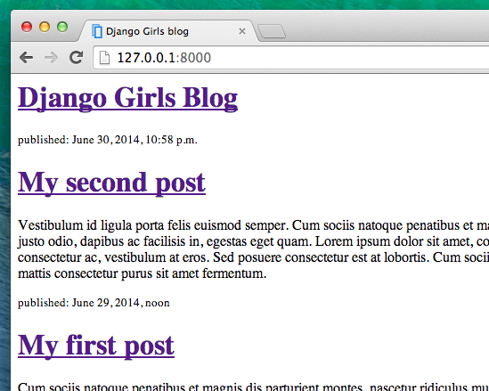

# Django šablóny

Prišiel čas zobraziť nejaké údaje! Na to nám Django ponúka užitočné zabudované **šablónové tagy**.

## Čo sú to šablónové tagy?

V HTML vlastne nemôžeš písať pythonový kód, pretože prehliadače mu nerozumejú. Poznajú len HTML. Vieme, že HTML je skôr statické, kým Python je oveľa dynamickejší.

**Šablónové tagy v Djangu** nám umožňujú previesť pythonové veci do HTML, takže dynamické webové stránky môžeš vytvoriť rýchlejšie. Paráda!

## Zobrazenie šablóny so zoznamom príspevkov

V predchádzajúcej kapitole sme našej šablóne dali zoznam príspevkov v premennej `posts`. Teraz ich zobrazíme v HTML.

Na vypísanie premennej v Django šablónach použijeme dvojitú zloženú zátvorku s názvom premennej vo vnútri, asi takto:

blog/templates/blog/post_list.html

```html
{{ posts }}
```

Vyskúšaj to vo svojej šablóne `blog/templates/blog/post_list.html`. Otvor ju vo svojom editore a nahraď elementy `<article>` týmto: `{{ posts }}`. Ulož súbor a obnov stránku, aby si videla výsledky:


Ako vidíš, dostali sme len toto:

blog/templates/blog/post_list.html

```html
<QuerySet [<Post: My second post>, <Post: My first post>]>
```

To znamená, že to Django chápe ako zoznam objektov. Pamätáš si z kapitoly **Úvod do jazyka Python**, ako môžeme zobraziť zoznamy? Áno, cyklami! V Django šablóne ich urobíš takto:

blog/templates/blog/post_list.html

```html

    {{ post }}

```

Vyskúšaj si to vo svojej šablóne.


Funguje to! Ale my chceme, aby sa príspevky zobrazili ako tie statické, ktoré sme vytvorili predtým v kapitole **Úvod do HTML**. HTML a šablónové tagy možno kombinovať. Naše `body` bude vyzerať takto:

blog/templates/blog/post_list.html

```html
<header>
    <h1><a href="/">Django Girls Blog</a></h1>
</header>


    <article>
        <time>published: {{ post.published_date }}</time>
        <h2><a href="">{{ post.title }}</a></h2>
        <p>{{ post.text|linebreaksbr }}</p>
    </article>

```

Všetko, čo dáš medzi `` a `` sa bude opakovať pre každý objekt v zozname. Obnov svoju stránku:



Všimla si si, že sme tentokrát použili trochu iný zápis (`{{ post.title }}` alebo `{{ post.text }}`)? Pristupujeme k údajom v každom z polí definovanom v našom modeli `Post`. Okrem toho, `|linebreaksbr` preposiela texty príspevkov cez filter, ktorý mení zalomenia riadkov na odstavce.

## Ešte jedna vec

Bolo by fajn vidieť, či bude tvoja web stránka stále funkčná aj na internete, však? Skúsme ju znova deploynúť na PythonAnywhere. Tu je rekapitulácia postupu…

* Najskôr pošli svoj kód na GitHub

command-line

    $ git status
    [...]
    $ git add .
    $ git status
    [...]
    $ git commit -m "Modified templates to display posts from database."
    [...]
    $ git push
    

* Potom sa prihlás do [PythonAnywhere](https://www.pythonanywhere.com/consoles/) a choď do **Bash konzoly** (alebo spusti novú) a zadaj:

PythonAnywhere command-line

    $ cd <your-pythonanywhere-domain>.pythonanywhere.com
    $ git pull
    [...]
    

(Nezabudni nahradiť `<your-pythonanywhere-domain>` svojou subdoménou na PythonAnywhere bez špicatých zátvoriek.)

* A nakoniec prejdi na [záložku Web](https://www.pythonanywhere.com/web_app_setup/) a stlač **Reload** na svojej webovej aplikácii. (Ak sa chceš dostať k ďalším stránkam na PythonAnywhere z konzoly, použi tlačítko v menu v pravom hornom rohu.) Tvoje zmeny by mali byť online na https://subdomena.pythonanywhere.com - over si to vo svojom prehliadači! Pokiaľ sa blogové príspevky na tvojej PythonAnywhere stránke nezhodujú s príspevkami na blogu, ktorý beží na tvojom lokálnom serveri, to je v poriadku. Databázy na tvojom lokálnom počítači a na PythonAnywhere sa nesynchronizujú spolu s tvojimi ostatnými súbormi.

Gratulujeme! Teraz skús pridať nový príspevok cez Django admina (nezabudni pridať published_date!). Uisti sa, že si v Django admin prostredí na svojej stránke na PythonAnywhere, https://subdomena.pythonanywhere.com/admin. Následne obnov stránku, aby si zistila, či sa tam príspevok objaví.

Funguje ako hodinky? Tešíme sa! Teraz si na chvíľku oddýchni od počítača, zaslúžiš si prestávku. :)

